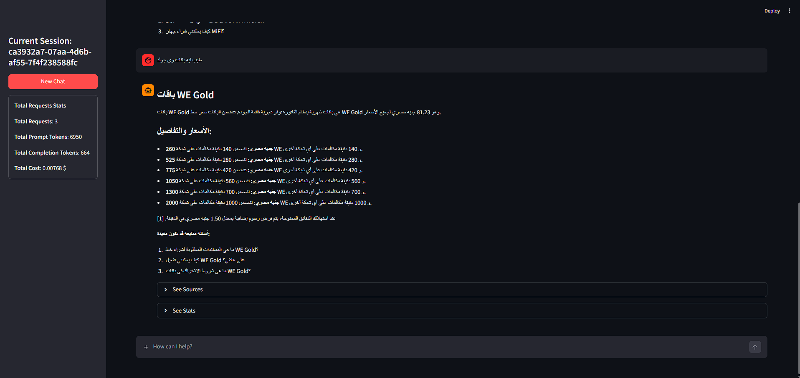

# WE Telecom Intelligent Assistant

A production-ready RAG-powered chatbot for **Telecom Egypt (WE)** that answers customer queries using the official [te.eg](https://te.eg) website as its knowledge base. Built with LangGraph, AWS Bedrock, and Streamlit.



---

## Overview

Telecom Egypt receives thousands of customer inquiries daily about services, plans, billing, and technical support. This assistant provides an AI-powered solution that:

- Answers questions grounded strictly in WE Telecom's official knowledge base
- Handles Arabic, English.
- Allows users to upload and query their own documents
- Provides source citations for every answer
- Tracks token usage and cost per session

---

## Architecture

The pipeline is built as a **LangGraph stateful agent graph** with the following nodes:

```
User Input
    │
    ▼
┌─────────────┐
│  init_state │  Resets per-turn state (chunks, tool calls)
└──────┬──────┘
       │
       ▼
┌──────────────────┐
│  intent_router   │  Keyword detection + semantic pre-search
│                  │  → scores query relevance to WE KB
│                  │  → forces search_kb if score ≥ 0.5
└──────┬───────────┘
       │
       ▼
┌──────────────┐
│   llm_call   │  Amazon Nova Pro via AWS Bedrock
│              │  → mandatory tool call if intent_router flagged
│              │  → optional tool call otherwise
└──────┬───────┘
       │
   tool_calls?
   ┌───┴────┐
  YES       NO
   │         │
   ▼         ▼
┌──────────┐  ┌─────────────────┐
│ tool_node│  │  output_response│
│search_kb │  │  (direct answer)│
└────┬─────┘  └────────┬────────┘
     │                  │
     └──► llm_call ◄────┘
          (loop up to 3x)
               │
               ▼
        output_response
               │
               ▼
          Final Answer
        + Source Chunks
```

### Key Design Decisions

**Intent Router** — before the LLM is called, a lightweight router runs keyword matching (Arabic + English WE-related terms) combined with a semantic pre-search against the vector DB. If the combined score ≥ 0.5, the LLM is forced to call `search_kb` before answering. This mimics hybrid retrieval behavior without a full hybrid vector store.

**Prompt Caching** — the system prompt is sent with a `cachePoint` marker (AWS Bedrock prompt caching), reducing input token costs on repeated calls within a session.

**Tool Call Limits** — `search_kb` is capped at 3 calls per turn to prevent infinite loops.

**Citation System** — the LLM is instructed to inline citations `[1]`, `[2]` per paragraph matching the order of retrieved chunks, which are then displayed in an expandable source panel in the UI.

---

## Features

| Feature | Details |
|---|---|
| Multi-lingual | Arabic, English, Egyptian dialect |
| Grounded answers | All WE-specific answers backed by KB retrieval |
| Source citations | Inline `[1][2]` per paragraph + expandable source panel |
| Document uploads | PDF, DOCX, TXT, HTML |
| Multi-turn memory | Per-session conversation history via LangGraph checkpointing |
| Cost tracking | Input/output tokens + USD cost per request and session total |
| Follow-up suggestions | LLM suggests 1–3 follow-up questions at end of each response |
| Guardrails | Blocks politics, religion, harmful content |

---

## Project Structure

```
.
├── app.py                    # Streamlit chat interface
├── rag/
│   ├── agent.py              # LangGraph agent graph
│   ├── tools.py              # search_kb FAISS vector search tool
│   ├── parse_files.py        # Document parser (PDF, DOCX, TXT, HTML)
│   ├── prompts.py            # System prompt with citations, guardrails
│   ├── clients.py            # AWS Bedrock LLM + embeddings clients
│   └── utils.py              # Token/cost callback handler
├── scraper/
│   ├── scrape_te.py          # crawl4ai async scraper for te.eg
│   └── clean_scraped.py      # Markdown post-processing pipeline
├── data/
│   └── selected/             # Curated KB documents (committed)
├── vectordb/                 # FAISS index files (generated locally)
├── notebooks/
│   └── Demo.ipynb            # Walkthrough notebook
├── requirements.txt
├── .env.example
└── README.md
```

---

## Setup

### Prerequisites

- Python 3.10+
- AWS account with Bedrock access
- Models enabled in your AWS region:
  - `us.amazon.nova-pro-v1:0`
  - `amazon.titan-embed-text-v2:0`

### 1. Clone the repository

```bash
git clone <repo-url>
cd we-telecom-chatbot
```

### 2. Create and activate a virtual environment

```bash
python -m venv .venv

# Windows
.venv\Scripts\activate

# macOS / Linux
source .venv/bin/activate
```

### 3. Install dependencies

```bash
pip install -r requirements.txt
```

### 4. Configure environment variables

```bash
cp .env.example .env
```

Edit `.env` with your values:

```env
AWS_REGION=us-east-1
AWS_Nova_Pro=us.amazon.nova-pro-v1:0
AWS_TITAN_EMBED_V2=amazon.titan-embed-text-v2:0
```

Then update `rag/clients.py` to load from the project root:

```python
load_dotenv()  # instead of the hardcoded path
```

AWS credentials should be configured via `~/.aws/credentials`, an IAM role, or environment variables (`AWS_ACCESS_KEY_ID`, `AWS_SECRET_ACCESS_KEY`).

### 5. Build the vector index

Place your knowledge base markdown files in `data/selected/`, then run the indexing cells in `notebooks/Demo.ipynb` to generate the FAISS index under `vectordb/`.

### 6. Run the app

```bash
streamlit run app.py
```

Open [http://localhost:8501](http://localhost:8501) in your browser.

---

## Usage

### Chat Interface

- Type your question in Arabic or English in the chat input
- The bot will retrieve relevant KB chunks and answer with inline citations
- Expand "See Sources" to view the raw retrieved chunks
- Expand "See Stats" to view token usage and cost for that request

### Document Upload

- Click the attachment icon in the chat input
- Upload a PDF, DOCX, TXT, or HTML file
- Ask a question — the document content will be injected as context alongside the KB

### New Chat

- Click "New Chat" in the sidebar to start a fresh session
- Session stats reset automatically

---

## RAG Pipeline Detail

### Retrieval — `search_kb`

Uses FAISS `similarity_search_with_score` with L2 distance normalized to a 0–1 similarity score:

```
similarity = 1 / (1 + L2_distance)
```

Chunks below `score_threshold=0.1` are filtered out. Returns up to `k=5` chunks with similarity scores attached to metadata.

### Intent Router

Runs before every LLM call. Combines:
1. Keyword scan — checks for WE-related terms in Arabic and English (`we`, `وي`, `plan`, `خطة`, `price`, `سعر`, etc.)
2. Semantic pre-search — runs `search_kb` and averages the similarity scores

If combined score ≥ 0.5, the LLM is forced to call `search_kb` via `tool_choice="search_kb"`.

### Document Parsing

| Format | Library |
|---|---|
| PDF | PyMuPDF (`fitz`) |
| DOCX | `python-docx` |
| HTML | `BeautifulSoup4` |
| TXT | Built-in file read |

Large documents are automatically truncated with a mid-document summary marker to stay within token limits.

---

## Dependencies

| Package | Purpose |
|---|---|
| `langchain`, `langgraph` | Agent graph and RAG orchestration |
| `langchain-aws` | AWS Bedrock LLM and embeddings |
| `langchain-community` | FAISS vector store integration |
| `faiss-cpu` | Vector similarity search |
| `streamlit` | Chat UI |
| `pymupdf` | PDF text extraction |
| `python-docx` | DOCX parsing |
| `beautifulsoup4` | HTML parsing |
| `crawl4ai`, `playwright` | JS-rendered web scraping of te.eg |
| `python-dotenv` | Environment variable loading |

---

## Models

| Role | Model | Provider |
|---|---|---|
| LLM | Amazon Nova Pro (`us.amazon.nova-pro-v1:0`) | AWS Bedrock |
| Embeddings | Titan Embed Text V2 (`amazon.titan-embed-text-v2:0`) | AWS Bedrock |
